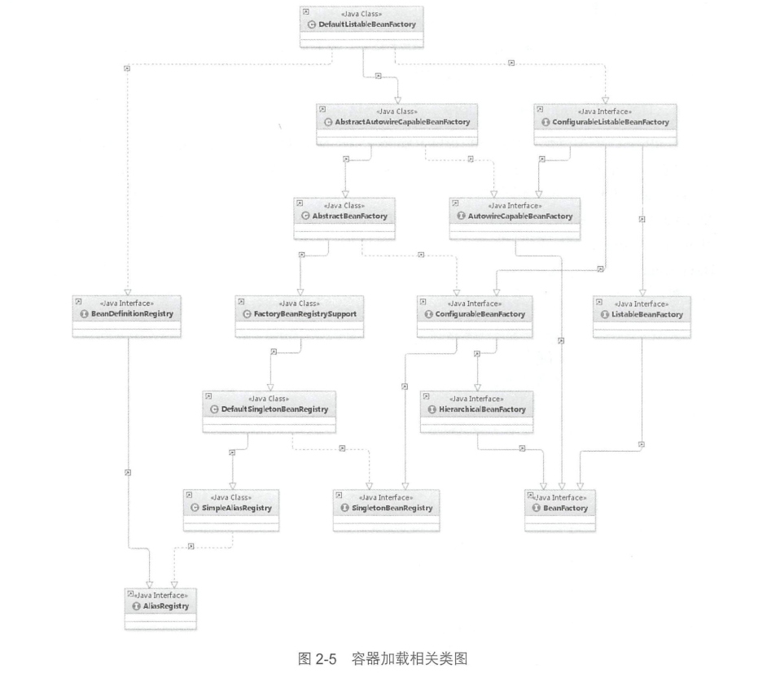

# Bean模块介绍
## beans包的层级结构
- src/main/java 用于展现Spring的主要逻辑
- src/main/resources 用于存放系统的配置文件
- src/test/java 用于对主要逻辑进行单元测试
- src/main/resources 用于存放测试用的配置文件

## 核心类介绍
### DefaultListableBeanFactory

- 【1】AliasRegistry：定义对alias的简单增删改等操作
- 【2】SimpleAliasRegistry：主要**使用map作为alias的缓存**，并对接口【1】AliasRegistry进行实现
- 【3】SingletonBeanRegistry：定义对单例的注册和获取
- 【4】BeanFactory：定义获取bean及bean的各种属性
- 【5】DefaultSingletonBeanRegistry：对接口【3】SingletonBeanRegistry各函数的实现。
- 【6】HierarchicalBeanFactory：【Hierarchical翻译：层级的】继承BeanFactory，也就是在BeanFactory定义的功能的基础上增加对parentFactory的支持
- 【7】BeanDefinitionRegistry：定义对BeanDefinition的各种增删改查操作
- 【8】FactoryBeanRegistrySupport：在【5】DefaultSingletonBeanRegistry基础上增加对FactoryBean的特殊处理功能
- 【9】ConfigurableBeanFactory：提供配置Factory的各种方法
- 【10】ListableBeanFactory：根据各种条件获取bean的配置清单
- 【11】AbstractBeanFactory：综合【8】FactoryBeanRegistrySupport和【9】ConfigurableBeanFactory的功能
- 【12】AutowireCapableBeanFactory：提供创建bean、自动注入、初始化以及应用bean后的处理器
- 【13】AbstractAutowireCapableBeanFactory：综合【11】AbstractBeanFactory并对接口Autowire CapableBeanFactory
- 【14】ConfigurableListableBeanFactory：BeanFactory配置清单，指定忽略类型及接口等
- 【15】DefaultListableBeanFactory：综合上面所有功能，主要是对bean注册后的处理